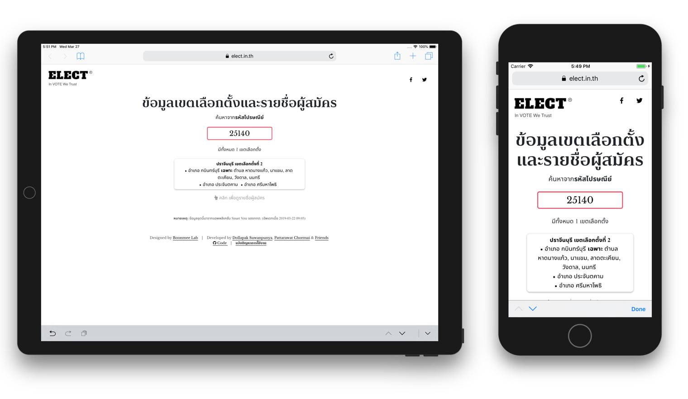

# Thailand Election'62 Zone and Candidate Dataset and Browsing Website

TODO: img


## Where and How did we get candidate data?

Two phases
### First Pharse
This dataset contains a list of candidates for Thailand's Election 2562, which will be held on March 24, 2562. 

The original data is [PDFs](https://www.ect.go.th/ect_th/news_all.php?cid=165) from The Election Commission of Thailand (ECT).

If you spot mistakes, please do report them [here](https://docs.google.com/spreadsheets/d/1T0-iBdBVl69q5N7Tz0fO70OtGdg70Fv0x5WiLTKOcGc/edit?usp=sharing).

### Second Pharse
MIMT Proxy

### Datasets (./data)
- Candidate informations

## Zone & Candidate Browsering Website
This website has two components, first page and zone pages. The first page has a form entering a postcode. We use React for HTML DOM manipulation. On the other hand, zone pages are just static files that are generated accordingly. Please see `generate-site.py` for more details.

### Development
Every change made to those pagaes, located in `election62`, requires a regeneration. One can use the following command to automatically update the site:
```
watch -n 10 'python generate-site.py --env dev'
```

Because the final web will be generated to `./dist`,  you can run a static web server from the root directory and access it via `http://<HOSTNAME>:<POST>/dist`. You might encouter cross-origin issues. If that the case, please check `deploy_path` in `generate-site.py`.

```
python -m SimpleHTTPServer
```

### Statistics
Pageviews...

## **Analysis**
### The presence of political families in 2019 general election
This Jupyter notebook investigates families with multiple MP candidates as well as their affiliation/electoral area in the 2019 Thai general election.  [[Notebook]](notebooks/political-dynasty.ipynb)

# Acknowledgement
This project is published as a part of [ELECT](https://elect.in.th). Founded by several parties who care about democracy and transparent information, ELECT has a mission to provide insightful information for Thai peopls to make a better voting decision. We would like to thank all volunteers behind ELECT, including The Matter, Boonmee Lab, and Minimore, and  all contributors on GitHub.