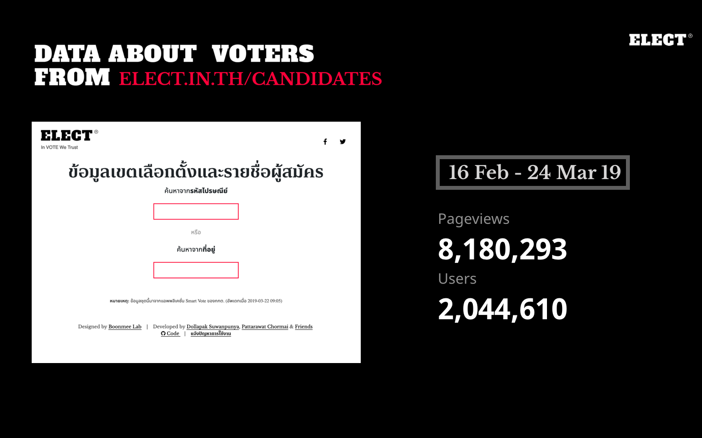

# Thailand Election'62 Zone and Candidate Dataset and Browsing Website


## How did we get candidate data?
In the beginning, we had only [PDFs](https://www.ect.go.th/ect_th/news_all.php?cid=165) from The Election Commission of Thailand (ECT). So, we had to parse them manually.
Details about parsing can be founded in `./notebooks/dev.ipyndb`. The process caused several issues, for example, typos from tone marks not ordered properly.

Around 20 Feb 2019, ECT released [SmartVote][smartvote] application, we then tracked down APIs that the application uses and were able to retreive the candidate and party information. 

Below are the datasets extracted from SmartVote's APIs.
1. Zone candidate information 
   ```./data/candidates.csv, ./data/detailed-candidates.csv```
2. Party-list candidate information
   ```./data/partylist_candidates.csv``` with help from [@c4n](//github.com/c4n)
3. Party information, including leader and secretary's names, address, logo, address, policy 
   ```/data/party-information.json, ./data/party-logos```

Details about tracking down API endpoints used by SmartVote will be written in TODO.

## Zone & Candidate Browsering Website
This website has no database. 
This website provides a quick and simple way for users to see who are candidates in their area, using postcode. As zone and candidate data is rarely changed, a static website is sufficient to this purpose without the use of backend and database. Apart from few components needed to be developed, the static-site approach can be massively scaled, for example deployed behind a CDN service. 

This website has two components, front page, zone and party pages. The first page has a form for entering a postcode or address. We use React for HTML DOM manipulation. Zone and party pages are static files that are generated accordingly. Please see `generate-site.py` for more details.

### Development
Every change made to those pagaes, located in `election62`, requires regeneration. One can use the following command to automatically update the site:
```
watch -n 10 'WEBPATH=127.0.0.1:8000 python generate-site.py --env dev'
```

The script generates the site to `./dist`. You can run a static web server from the root directory and access it via `http://<WEBPATH>/dist`. You might encouter cross-origin issues. If that the case, please verify the value of `WEBPATH`.

For example, one can use Python's web server module for this purpose:
```
python -m SimpleHTTPServer
```

### Statistics
Pageviews...


## **Analysis**
### The presence of political families in 2019 general election
This Jupyter notebook investigates families with multiple MP candidates as well as their affiliation/electoral area in the 2019 Thai general election.  [[Notebook]](notebooks/political-dynasty.ipynb)

# Acknowledgement
This project is published as a part of [ELECT](https://elect.in.th). Founded by several parties who care about democracy and transparent information, ELECT has a mission to provide insightful information for Thai peopls to make a better voting decision. We would like to thank all volunteers behind ELECT, including The Matter, Boonmee Lab, and Minimore, and  all contributors on GitHub.

[mitmproxy]: https://mitmproxy.org
[smartvote]: https://itunes.apple.com/th/app/smart-vote/id1447199802?l=th&mt=8